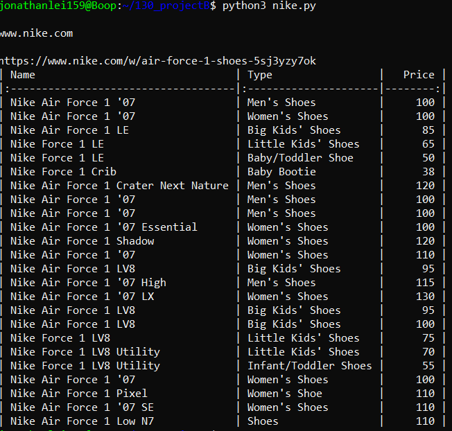
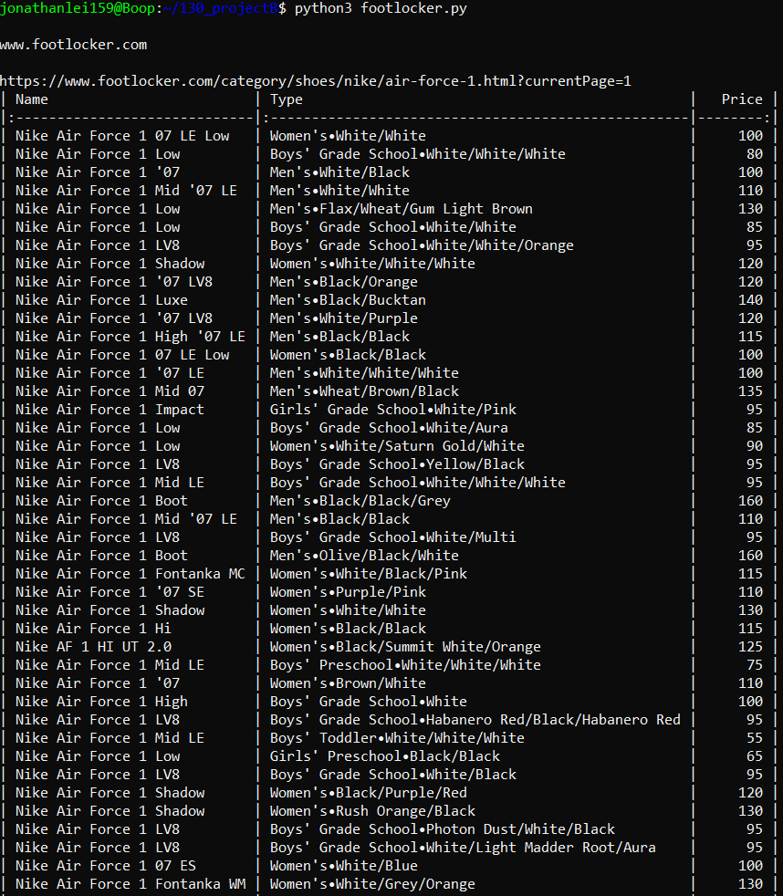
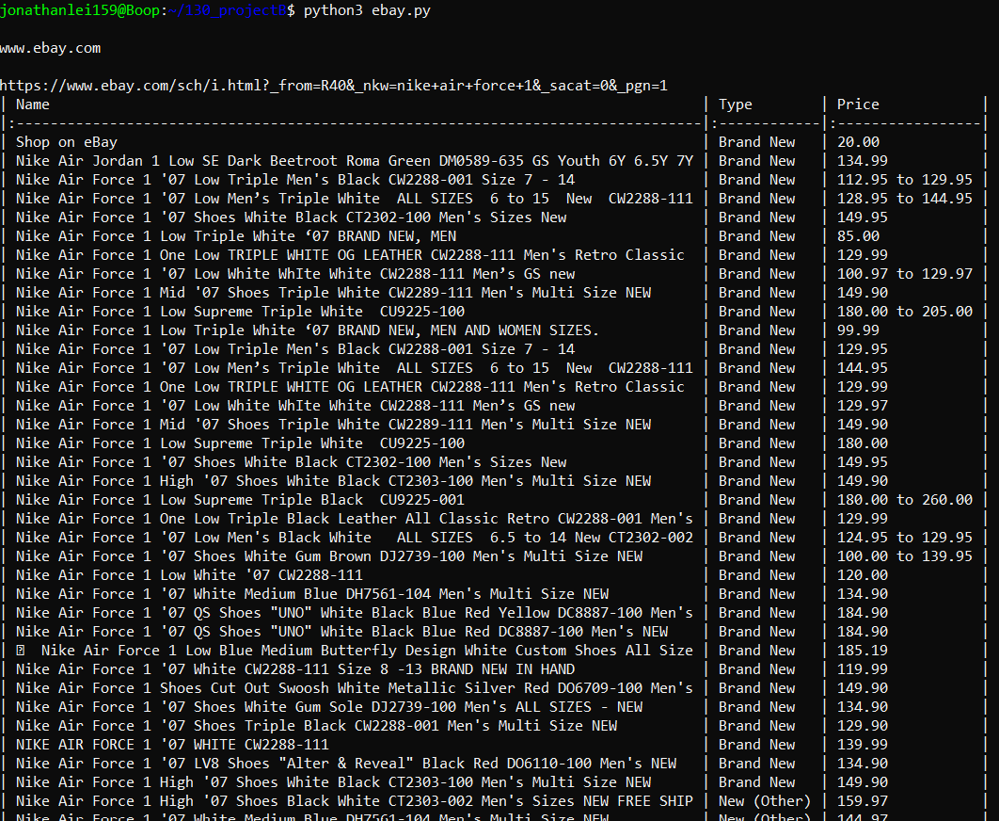
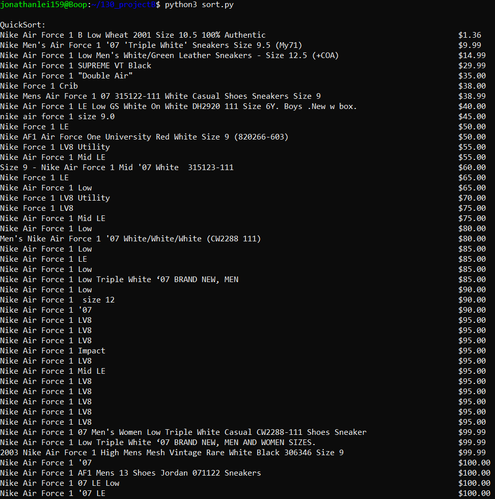
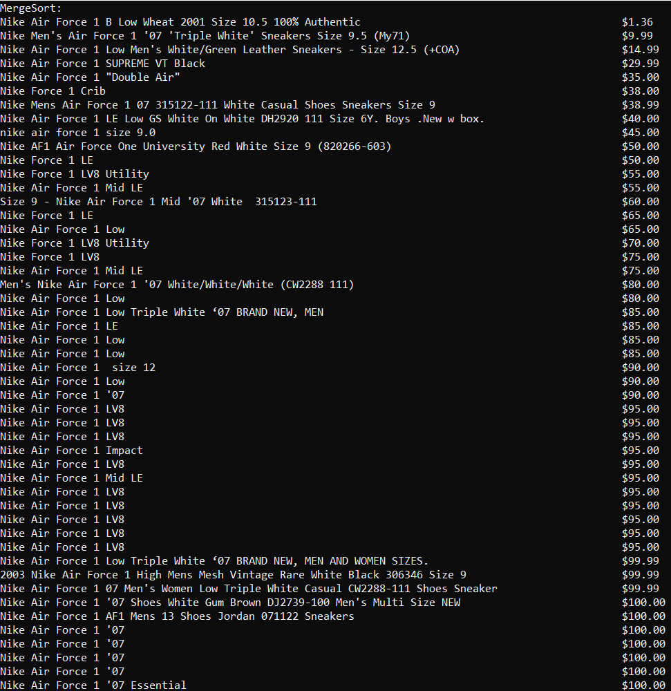

# Project_WebKraw
- CMPE-130 Project: Creating a web crawler with Python, HTML, and Flask

## Table of Contents
* [General Info](#general-info)
* [Technologies](#technologies)
* [Setup](#setup)
* [How to Run](#how-to-run)
* [Example](#example)
* [Websites Used](#websites-used)
* [Team Members](#team-members)

## General Info
Simple web crawler to scrape prices from online stores for Nikes Air Force 1

## Technologies
Project is created with:
* Python - 3.8.10
* Flask - 1.1.1

## Setup
Before running this project, install using:
```
$ pip install beautifulsoup4
$ pip install bs4
$ pip install flask
$ pip install fonttools
$ pip install pandas
$ pip install requests
$ pip install urllib3
$ pip install tabulate
$ pip install numpy
```

## How to Run
To run this project, type in:
```
$ python3 main.py
$ python3 nike.py
$ python3 ebay.py
$ python3 footlocker.py
$ python3 sort.py
```
On a browser, type in:
```
127.0.0.1:5000
```

## Example
Creating the dataframes:




Sorting all the prices:



## Websites Used
Web scraped these sites:
```
https://www.ebay.com/
https://www.nike.com/
https://www.footlocker.com/
```

## Team Members
- Ayaz Azhar (@azharayaz99)
- Eugene Chan (@Eugene-Chan2021Fall)
- Jared Lagman (@jaredlagman)
- Jonathan Lei (@JonathanL159)
